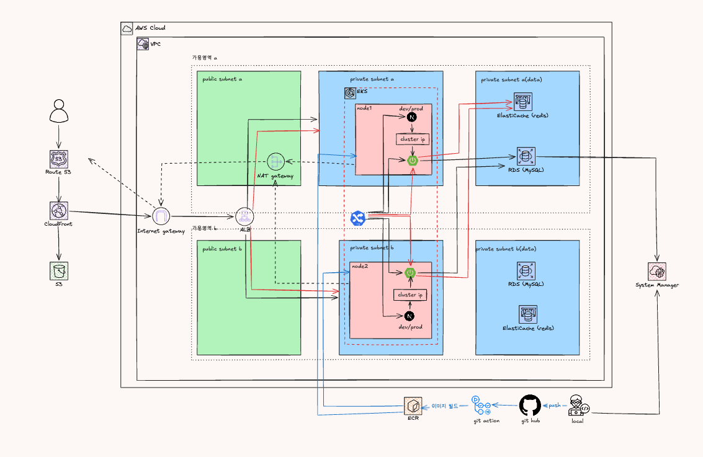
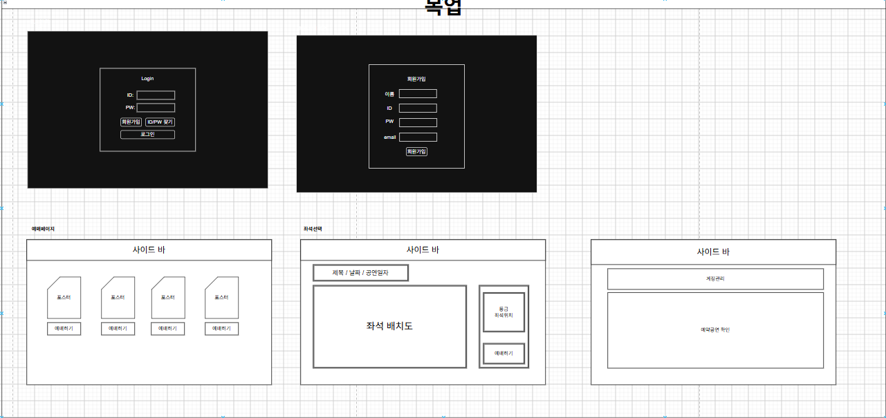
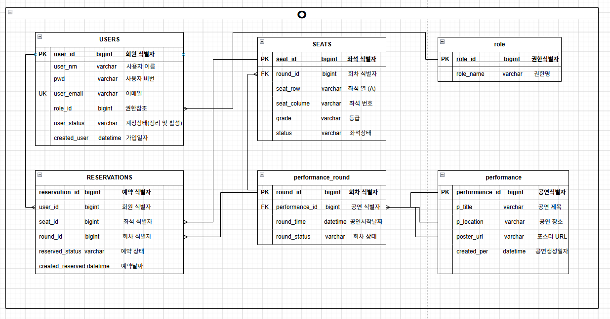
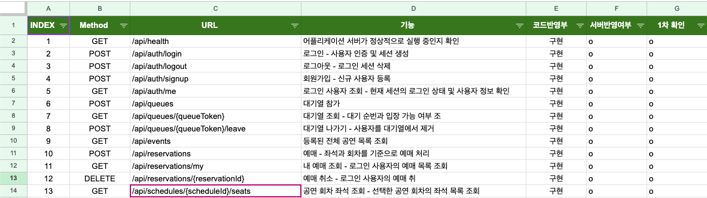

# Qket — 공연 예매 시스템

> 5조 인잇뿌볼 | Spring Boot + Next.js + AWS EKS 기반 공연 예매 플랫폼

---

## 아키텍처



---

## 주요 화면



---

## ERD



---

## API 명세서



---

## 사용자 흐름도


---

## 기술 스택

| 레이어 | 기술 |
|--------|------|
| Frontend | Next.js 14 (App Router), TypeScript |
| Backend | Spring Boot 3.5.6, Java 21, MyBatis |
| Database | MySQL 8.0 (AWS RDS) |
| Cache / 세션 | Redis 7 (AWS ElastiCache) |
| 인프라 | AWS EKS, ALB, ECR, CloudFront, Route53 |
| CI/CD | GitHub Actions |

---

## 로컬 실행 방법

### 사전 준비

- Docker Desktop 설치
- Java 21
- Node.js 18+

### 1. DB / Redis 실행 (Docker Compose)

```bash
# 실행
docker-compose up -d

# 종료
docker-compose down

# 종료 + 데이터 초기화
docker-compose down -v
```

### 2. Backend 실행

```bash
cd backend
./gradlew bootRun
# http://localhost:8080
```

### 3. Frontend 실행

```bash
cd frontend
npm install
npm run dev
# http://localhost:3000
```

---

## Branch 전략

| 브랜치 | 역할 |
|--------|------|
| `main` | 운영 (Production) |
| `dev` | 개발 통합 |
| `feature/*` | 기능 개발 |
| `infra/*` | 인프라 설정 |

### 작업 흐름

```bash
# 1. dev 최신화
git checkout dev
git pull origin dev

# 2. 작업 브랜치 생성
git checkout -b feature/기능명 origin/dev

# 3. 작업 후 커밋
git add .
git commit -m "feat: 작업내용"

# 4. 푸시
git push origin feature/기능명

# 5. dev에 병합
git checkout dev
git pull origin dev
git merge origin/feature/기능명
git push origin dev
```

---

## Commit Convention

| 타입 | 설명 |
|------|------|
| `feat` | 새로운 기능 추가 |
| `fix` | 버그 수정 |
| `docs` | 문서 수정 |
| `style` | 코드 스타일 수정 |
| `refactor` | 코드 구조 개선 |
| `test` | 테스트 코드 추가 |
| `chore` | 빌드 설정 등 기타 작업 |
| `infra` | 인프라 설정 변경 |

---
## K8s 배포

```bash
# Namespace 생성
kubectl apply -f k8s/namespace_qKet.yaml

# Secret / ConfigMap 적용 (env_qKet.example.yaml 복사 후 값 채울 것)
cp k8s/env_qKet.example.yaml k8s/env_qKet.yaml
kubectl apply -f k8s/env_qKet.yaml

# NetworkPolicy 적용
kubectl apply -f k8s/networkpolicy_qKet.yaml

# Backend / Frontend 배포
kubectl apply -f k8s/deploy_https_qKet_backend.yaml
kubectl apply -f k8s/deploy_https_qKet_frontend.yaml

# Ingress 적용
kubectl apply -f k8s/ingress_https_REMOVED.yaml
```

- 기능 추가: `feat: 회원가입 기능 추가`
- 버그 수정: `fix: 로그인 오류 수정`
- 문서 수정: `docs: API 문서 업데이트`
- 코드 리팩토링: `refactor: 로그인 로직 개선`

